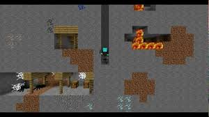

## IMPORTANT MESSAGE

# ATTENTION ALL GAMERS
### RED ALERT

YOUR ACCOUNT HAS BEEN BREACHED

```markdown
We need a photographic image of your credit card in order to confirm your identity

Without it, we can not confirm that your account has not been breached.

Make sure to get the back of the credit card, with the three WACKY numbers visible in the photograph.

The images should be emailed directly to email@robloxcom.me NOW.

NOW GET OUT THERE GAMERS AND TAKE THOSE PHOTOGRAPHS
```

## DONT FORGET, YOUR ACCOUNT IS AT SAKE.

 WE NEED YOUR CREDIT CARD INFORMATION TO STOP THE ATTACK

 FOLLOW THE INSTRUCTIONS IMMEADIATLEY BEFORE IT IS TOO LATE

# STAY STRONG GAMERS


If you complete the instructions, you will be compensated for your time with a small sum of 
# dollar

Please complete the transaction now.

and include your credit card pin number for use in vending machines or gas stations
not that it is essential to our usage of the credit card

#and always remember

```
Whether we wanted it or not, we've stepped into a war with the Cabal on Mars. So let's get to taking out their command, one by one. Valus Ta'aurc. From what I can gather, he commands the Siege Dancers from an Imperial Land Tank just outside of Rubicon. He's well protected, but with the right team, we can punch through those defenses, take this beast out, and break their grip on Freehold.
```

<br/><br/><br/><br/><br/><br/><br/><br/><br/><br/><br/><br/><br/><br/><br/><br/>

#### stop scrolling down

<br/><br/><br/><br/><br/><br/><br/><br/><br/><br/><br/><br/><br/><br/><br/><br/>

# stop

<br/><br/><br/><br/><br/><br/><br/><br/><br/><br/><br/><br/><br/><br/><br/><br/><br/><br/><br/><br/><br/><br/><br/><br/><br/><br/><br/><br/><br/><br/><br/><br/><br/><br/><br/><br/><br/><br/><br/><br/><br/><br/><br/><br/><br/><br/><br/><br/><br/><br/><br/><br/><br/><br/><br/><br/><br/><br/><br/><br/><br/><br/><br/><br/><br/><br/><br/><br/><br/><br/><br/><br/><br/><br/><br/>

# you will be hunted

<br/><br/><br/><br/><br/><br/><br/><br/><br/><br/><br/><br/><br/><br/><br/><br/><br/><br/><br/><br/><br/><br/><br/><br/><br/><br/><br/><br/><br/><br/><br/><br/><br/><br/><br/><br/><br/><br/><br/><br/><br/><br/><br/><br/><br/><br/><br/><br/><br/><br/><br/><br/><br/><br/><br/><br/><br/><br/><br/><br/><br/><br/><br/><br/><br/><br/><br/><br/><br/><br/><br/><br/><br/><br/><br/><br/><br/><br/><br/><br/><br/><br/><br/><br/><br/><br/><br/><br/><br/><br/><br/><br/><br/><br/><br/><br/><br/><br/><br/><br/><br/><br/><br/><br/><br/><br/><br/><br/>

# this is us 


<script>
 
 alert("test")
 
 </script>
